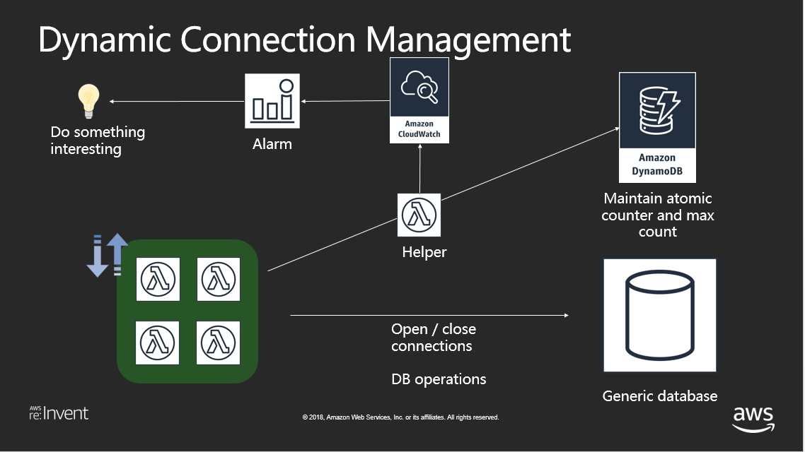
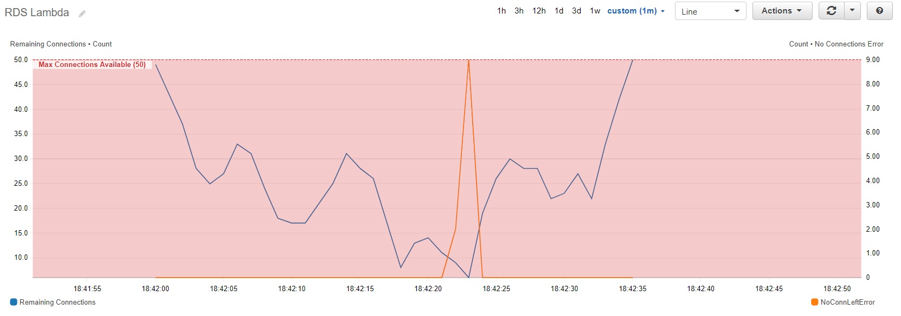

# Dynamic Connections Management for RDS/RDBMS solutions

A connections management solution when using Lambda with RDS/RDBMS solutions.

## Background

There are some inherent challenges with using AWS Lambda with RDS/RDBMS solutions, associated with connections management. The Lambda container model manages the containers lifecycle, which host lambda function invocations. Some of the features of this container model are:
1. Lambda containers lifecycle are managed by the AWS Lambda service. It doesn't provide developers any control or indication over creation and destruction of containers.
2. One container can only host one Lambda function invocation at a time, although they can be reused to execute multiple invocations of the same lambda function, serially.
3. Containers are neither shared across Lambda functions nor across AWS accounts.
4. Lambda has a 'global' section, which is executed once for the life time of the container. The 'handler' section is executed once per function invocation.

The above features mean using traditional connection pooling with Lambda, to access RDS/RDBMS solutions, doesn't make too much sense. If the connection pool is initialized in the global section, with multiple connections, only one connection (per container) will actually be used and rest will just count towards the DB connections quota, unused. Also, there is no hook to tap into and destroy these connection pools, once the container reaches end of life.

As a result, the best practice is to just use one connection per lambda container, initialized in the global section of the lambda function and relying on the DB server TTL to reclaim it.

Lambda concurrency limits also help mitigate some of the challenges, but some still remain:
1. Using a global connection variable inside the handler ensures that any new connections stay open for subsequent calls. But in the case of MySQL and PostgreSQL there is risk of session leakage across the open connection that can result in locking issues.
2. Since the concurrency limit is applied to 'Account' level, you might have to create separate AWS accounts to segregate different serverless applications, which have different throttling requirements.
3. You can apply concurrency limits at the functional level too. In this case, concurrency limits should correspond to 'peak' invocations, which might not be known, and one might end up in overprovisioning / under provisioning of DB connections.
4. Lambda hotspots: From the DB perspective, if multiple lambda functions (or serverless applications) are accessing the DB, it becomes a challenge to dynamically allocate connections to a Lambda which is currently running 'hot', due to some external factors like time of the day/year, seasonal promotions, application dynamics etc.


Dynamic Connections Management tries to address these challenges.

## Contents

I have chosen Python as the language of choice and will be using MySQL RDS as a RDBMS solution.

This repository contains the sample code for test and helper Lambda functions, DynamoDB table, MySQL RDS instance as well as a SAM template to deploy the resources in an AWS region of your choice. It also leverages CloudFormation custom resources to prepare the MySQL and DynamoDB instance with test data.

# Solution Architecture




The solution consists of maintaining a row in a DynamoDB table, which keeps track of the 'Maximum allowed connections' and 'connections in use' for a given DB. A helper lambda function is used to manipulate this count. This helper lambda function is called by the parent lambda, which wants to talk to the DB in question. The parent lambda function calls the helper once when it opens the connection and once when it closes the connection. To avoid any session leakage issues / locking issues, we open and close the connection in in each handler call.

Depending on the response from the helper lambda function (connections are available or not), the parent lambda function decides its course of action. The helper lambda function also publishes 2 metrics to Cloudwatch: 'Remaining Connections' and 'No Connections Left Error', which can then be used to create an alarm and do something interesting, like backing off the load on the DB or providing an alternate source for querying the same data.


Below is a snapshot of a test run, blue shows the 'Remaining Connections' (left Y Axis) and orange shows the 'No Connection Left Error' (right Y axis).



You can now create alarms on these metrics and use them to do something interesting.

# Deployment and Execution

## Instructions

This code depends on a bunch of libraries (not included in this distribution) which you will have to install yourself. You will be needing [AWS CLI](http://docs.aws.amazon.com/cli/latest/userguide/installing.html) as well. The code comes with a SAM template, which you can use to deploy the entire solution.

1. Download the contents of this repository on your local machine (say: project-directory)
2. The solution is implemented in python, so make sure you have a working python environment on your local machine.
3. Open a command prompt, navigate to the project directory. Navigate to the /code sub directory and install the following libraries: 
    1. ```bash
        pip install pymysql --target .
        ```
4. Create a S3 bucket for deployment (note: use the same region throughout the following steps, I have used us-west-2, you can replace it with the region of your choice. Refer to the [region table](https://aws.amazon.com/about-aws/global-infrastructure/regional-product-services/) for service availability.)
    1. ```bash
        aws s3 mb s3://rdslambdademo2017-us-west-2 --region us-west-2
        ```
5. We shall be using the LambdaRDS_Demo.yaml file as our SAM template.

6. Package the contents and prepare deployment package using the following command
    1. ```bash
        aws cloudformation package --template-file LambdaRDS_Demo.yaml --output-template-file LambdaRDS_Demo_output.yaml --s3-bucket rdslambdademo2017-us-west-2 --region us-west-2
        ```
7. Replace the placeholders in the below command with username, password and dbname, and deploy the package:
    1. ```bash 
        aws cloudformation deploy  --template-file LambdaRDS_Demo_output.yaml --stack-name RDSLambdaDemoStack --capabilities CAPABILITY_IAM --parameter-overrides RDSUserName=<username> RDSPassword=<password> RDSDBName=<dbname> --region us-west-2
        ```
8. If you want to make changes to the Lambda functions, you can do so on your local machine and redeploy them using the steps 6 and 7 above. The package and deploy commands take care of zipping up the new Lambda files (along with the dependencies) and uploading them to AWS for execution.

## Outputs
Following are the outputs from the SAM template

1. **RDS MySQL Server:** You can use this endpoint to login to your RDS SQL Server. Please note, you might have to modify the security groups associated with your MySQL instance.

## Execution
 The TestHarness_Input.json file contains sample invocations that you can use to trigger the load test. Navigate to your Lambda console, look for the LambdaRDS_TestHarness function and create a test event. You can modify the test iterations count to your choice.

 Please note, the LambdaRDS_Test function has a 'sleep' function to simulate some random querying times for the query. You should comment this out for production deployments.

 Once the test finishes, you can navigate to your CloudWatch console and look for 'RDSLambda' metrics under the 'Custom' namespace. You can then plot these metrics and interact with them.

 

 
# Code Walkthrough

1. **LambdaRDS_Demo**: SAM template
2. **LambdaRDS_Test**: Test Lambda function to simulate opening and closing of DB connections.
3. **LambdaRDS_ManageConnections**: Helper function: Used to maintain an atomic counter in DynamoDB table, along with publishing metrics to cloudwatch. Should be called by #2 above before opening a connection and after closing a connection.
4. **LambdaRDS_TestHarness**: Test harness used to simulate load on LambdaRDS_Test function.
5. **TestHarness_Input**: Input for test harness function.
6. **LambdaRDS_CFNInit**: Custom resource lambda function used to insert test data into RDS and DynamoDB. Executed when the CloudFormation template is created, updated or deleted.

## Further Reading:
1. AWS re:Invent 2017 Chalktalk: [Best Practices for using AWS Lambda with RDS-RDBMS Solutions (SRV320)](https://www.slideshare.net/AmazonWebServices/best-practices-for-using-aws-lambda-with-rdsrdbms-solutions-srv320)
2. AWS Database Blog: [Query your AWS database from your serverless application](https://aws.amazon.com/blogs/database/query-your-aws-database-from-your-serverless-application/)

## License

This library is licensed under the Apache 2.0 License. 
